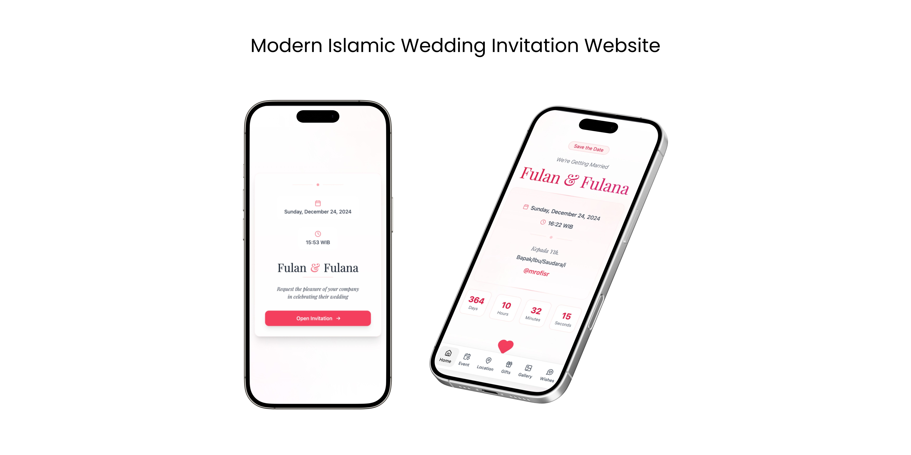

# Sakeenah: Modern Islamic Wedding Invitation



A modern, interactive wedding invitation website built with Vite (React), Tailwind CSS, and Framer Motion. Created by [@mrofisr](https://github.com/mrofisr).

## Features
- Modern design & smooth animations
- Fully responsive & mobile-first layout
- Background music & interactive wishes (WIP)
- Fun confetti effects and countdown timer
- Google Maps integration

## Tech Stack
- [Vite (React)](https://vite.dev/)
- [Tailwind CSS](https://tailwindcss.com/)
- [Framer Motion](https://www.framer.com/motion/)
- [Lucide Icons](https://lucide.dev/)
- [React Confetti](https://www.npmjs.com/package/react-confetti)

## Installation
1. Clone the repository and install dependencies:
  ```bash
  git clone https://github.com/mrofisr/wedding-invitation.git
  cd wedding-invitation
  bun install
  ```
2. Update your wedding details in `src/config.js`.
3. Start the development server:
  ```bash
  bun run dev
  ```
  Open [http://localhost:3000](http://localhost:3000) in your browser.

## Customization
Edit `src/config.js` to change details like the wedding title, names, and colors. For example:
```JavaScript
const config = {
  data: {
    title: "Pernikahan Fulan & Fulana",
    description:
      "Kami akan menikah dan mengundang Anda untuk turut merayakan momen istimewa ini.",
    groomName: "Fulan",
    brideName: "Fulana",
    parentGroom: "Bapak Groom & Ibu Groom",
    parentBride: "Bapak Bride & Ibu Bride",
    date: "2024-12-24",
    maps_url: "https://goo.gl/maps/abcdef",
    maps_embed:
      "https://www.google.com/maps/embed?pb=!1m18!1m12!1m3!1d3966.0000000000005!2d106.8270733147699!3d-6.175392995514422!2m3!1f0!2f0!3f0!3m2!1i1024!2i768!4f13.1!3m3!1m2!1s0x2e69f4f1b6d7b1e7%3A0x2e69f4f1b6d7b1e7!2sMonumen%20Nasional!5e0!3m2!1sid!2sid!4v1633666820004!5m2!1sid!2sid",
    time: "16:16 - 17:30 WIB",
    location: "Grand Ballroom, Hotel Majesty",
    address: "Jl. Jend. Sudirman No.1, Jakarta",
    ogImage: "/images/og-image.jpg",
    favicon: "/images/favicon.ico",
    agenda: [
      {
        title: "Akad Nikah",
        date: "2024-12-24",
        startTime: "16:16",
        endTime: "17:30",
        location: "Grand Ballroom, Hotel Majesty",
        address: "Jl. Jend. Sudirman No.1, Jakarta",
      },
      {
        title: "Resepsi Nikah",
        date: "2024-12-24",
        startTime: "16:16",
        endTime: "17:30",
        location: "Grand Ballroom, Hotel Majesty",
        address: "Jl. Jend. Sudirman No.1, Jakarta",
      }
    ],
    audio: {
      src: "/audio/fulfilling-humming.mp3",
      title: "Fulfilling Humming",
      autoplay: true,
      loop: true
    },
    banks: [
      {
        bank: "Bank Central Asia",
        accountNumber: "1234567890",
        accountName: "FULAN",
      },
      {
        bank: "Bank Mandiri",
        accountNumber: "0987654321",
        accountName: "FULANA",
      }
    ]
  }
};

export default config;

```

## License
This project is licensed under the [Apache License 2.0](https://opensource.org/licenses/Apache-2.0). You can use, modify, and distribute it as long as you include the original copyright notice and license.

## Contributing & Support
Contributions and issue reports are welcome. If this project helped you, give it a ⭐️!

## Contact
- GitHub: [@mrofisr](https://github.com/mrofisr)
- Instagram: [@mrofisr](https://instagram.com/mrofisr)

May Allah guide us all.
